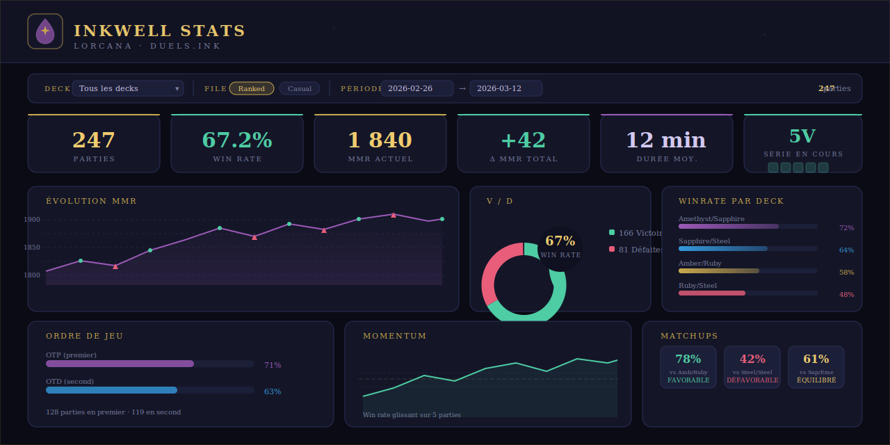

<div align="center">
  

# Inkwell Stats — Lorcana Dashboard

> Dashboard analytique client-side pour **Disney Lorcana** — importe ton historique CSV depuis [duels.ink](https://duels.ink) et visualise tes statistiques en temps réel.

[](https://github.com/Gon3s/lorcana-stats/actions/workflows/ci.yml)
[](https://github.com/Gon3s/lorcana-stats/actions/workflows/deploy.yml)

**Démos live**
- GitHub Pages : [gon3s.github.io/lorcana-stats](https://gon3s.github.io/lorcana-stats/)
- Vercel : [lorcana-stats.vercel.app](https://lorcana-stats.vercel.app)



</div>

---

## Fonctionnalités

### Tableau de bord principal

| Section | Contenu |
|---|---|
| **KPIs** | Parties jouées · Victoires/Défaites · Win rate · MMR actuel · Durée moyenne |
| **Évolution MMR** | Courbe chronologique colorée par résultat |
| **Répartition V/D** | Donut avec chiffres clés |
| **Volume quotidien** | Barres empilées par jour |
| **Ordre de jeu** | Win rate OTP vs OTD |
| **Durée des parties** | Histogramme de distribution |

### Statistiques par Encre

| Section | Contenu |
|---|---|
| **Winrate par deck** | Tes combinaisons de couleurs, classées par performance |
| **Winrate vs adversaire** | Contre quels archétypes tu performes |
| **Winrate par combinaison** | Chaque bicolorité avec barre de progression |
| **Matrice de matchups** | Grille encre × encre colorisée par force du matchup |

### Analyses avancées

| Section | Contenu |
|---|---|
| **Momentum** | Win rate glissant sur 5 parties + détection de séries |
| **Prédicteur de matchup** | Win rate historique contre chaque combinaison adverse |
| **Comparaison hebdomadaire** | Cette semaine vs semaine précédente |
| **Meilleur/Pire deck** | Classement récent (20 dernières parties) |

### Page Mes Decks

- Profil complet par deck avec decklist intégrale
- Détection automatique des **versions successives** (quand la composition change)
- **Diff visuel** entre deux versions (cartes ajoutées / retirées / modifiées)
- Stats par version : win rate, MMR moyen/partie, dates jouées

### Filtres

- **Deck** — sélecteur avec sous-filtre par version si plusieurs versions détectées
- **File de jeu** — filtre par queue (Ranked, Casual…), masqué si une seule file
- **Période** — plage de dates avec défaut à 15 derniers jours
- Tous les graphiques se mettent à jour en temps réel

---

## Import des données

1. Connecte-toi sur [duels.ink](https://duels.ink)
2. Accède à ton **Historique de parties**
3. Clique sur **Exporter CSV**
4. Glisse-dépose le fichier sur le dashboard (ou utilise le bouton de sélection)

> **Confidentialité** — toutes les données restent dans ton navigateur. Aucune information n'est transmise à un serveur externe.

---

## Stack technique

| Couche | Technologie |
|---|---|
| Langage | Vanilla JavaScript (ES Modules, sans bundler) |
| Styles | Tailwind CSS v3 + variables CSS personnalisées |
| Graphiques | [Chart.js 4](https://chartjs.org) via CDN |
| Parsing CSV | [PapaParse 5](https://papaparse.com) via CDN |
| Polices | [Cinzel + Crimson Pro](https://fonts.google.com) |
| Déploiement | GitHub Pages (principal) · Vercel (miroir) |
| CI/CD | GitHub Actions |

Aucun framework, bundler ou transpileur — les modules ES sont chargés directement par le navigateur.

---

## Structure du projet

```
lorcana-stats/
├── index.html                  # Point d'entrée unique
├── decks.html                  # Page Mes Decks
├── assets/
│   ├── logo.svg                # Logo de l'application
│   └── inks/                   # Icônes officielles Lorcana (PNG)
├── screenshots/
│   └── preview.svg             # Aperçu du dashboard
├── css/
│   ├── style.css               # Styles personnalisés + variables CSS
│   ├── tailwind.input.css      # Directives Tailwind (@tailwind …)
│   └── tailwind.css            # Généré — ne pas modifier manuellement
├── js/
│   ├── app.js                  # Orchestrateur principal
│   ├── store.js                # État centralisé (jeux + filtres actifs)
│   ├── parser.js               # Parsing et validation du CSV
│   ├── constants.js            # Constantes partagées
│   ├── charts/                 # Graphiques Chart.js (MMR, distribution, gameplay)
│   ├── advanced/               # Analyses avancées (momentum, matchups, weekly…)
│   ├── ui/                     # Composants UI (filtres, écrans, dashboard)
│   ├── utils/                  # Utilitaires (ink, deck-builder)
│   └── pages/
│       └── decks.js            # Page Mes Decks
├── data/
│   └── game-history.csv        # CSV d'exemple pour les tests
└── .github/workflows/          # CI (validation) + CD (déploiement)
```

---

## Développement local

```bash
# Installer les dépendances (Tailwind CLI uniquement)
npm install

# Compiler le CSS une fois
npm run build:css

# Mode watch (recompilation automatique)
npm run watch:css
```

Un serveur HTTP est nécessaire (les ES modules ne fonctionnent pas en `file://`) :

```bash
npx serve .
# ou
python -m http.server 8000
```

Puis ouvre `http://localhost:8000` et charge `data/game-history.csv` pour tester.

---

## Déploiement

### GitHub Pages
Le déploiement se déclenche automatiquement à chaque push sur `main` via GitHub Actions.
Pour un nouveau fork :
1. **Settings → Pages** → source : **GitHub Actions**
2. Push sur `main` — le workflow déploie automatiquement

### Vercel
Connecte le dépôt sur [vercel.com](https://vercel.com) — aucune configuration requise, le projet est entièrement statique.
